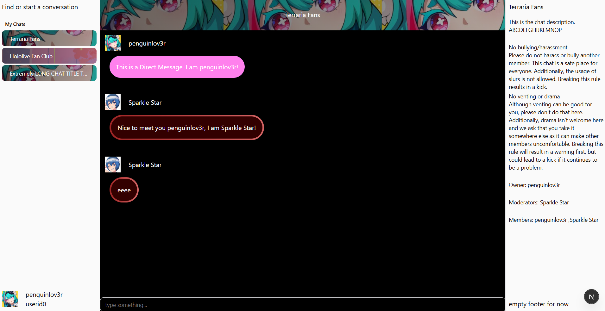

# Web Chat Frontend Exercise

### About

This is a front-end landing page for a chat app which pulls data from a JSON within the project directory.

### Setup

After cloning the repo, you need to open two terminals simultaneously. On one, execute

`npm run dev`

and this should host the website on `localhost:3000`.

On the second terminal, we're going to host the dummy backend using [json-server](https://github.com/typicode/json-server).

Run the command `json-server --watch ./_data/db.json --port 4000` on the second terminal. (If this does not work follow the setup on the [json-server documentation](https://github.com/typicode/json-server)).

### How this was made

The stack is as follows:

* Typescript
* React
* Nextjs
* TailwindCSS

### AI/External Resources

Unless specified in the comments above a particular piece of code, 100% of this front-end was written by me. This means every poor decision is completely my own.

The exception is everything in the `src/components/ui` directory. All of those files were imported by [shadcn](https://ui.shadcn.com/) (such as the sidebars which would have been difficult to build on my own). Additionally, shadcn also generated the `globals.css` file.

### Questions

I have hardly worked with anything in this stack before, so I'd like some guidances on best practices particularly with respect to data handling.

#### Server versus Client Distinction

How should I be passing data back and forth between the components?

In particular, this server/client issue is why I'm simultaneously maintaing a `theme.tsx` (available to server and client) and a `globals.css` (available only to client), when what would really be optimal is a singular source of truth.

This distinction is also why there are some files like `chats-sidebar-client-boundary.tsx`; I don't currently know best practice for separation, and why there are files like `ChatContext.tsx` which are completely unused for now.

#### Dummy API

The second place I'd like guidance is with my dummy API: `src/api/get-from-database.tsx`. Is this a good way to simulate an actual API?

#### Routing

The URL currently manages all routing within the database. As it stands, `localhost:3000/[userid]/[chatid]` dictates navigation. Is this a good idea?

**I'd love to discuss the project with you, particularly in some sort of synchronous meeting!**